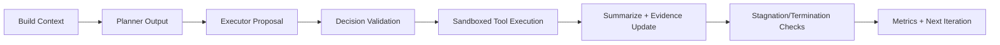

# agent-core

Production-grade, domain-agnostic autonomous agent orchestration engine.

`agent-core` provides deterministic loop control, bounded memory, strict tool governance, and evidence-driven reasoning for long-running LLM agents.

## What It Is
- A bounded cognitive operating system for autonomous reasoning
- A clean-architecture engine with replaceable subsystems
- A foundation for domain profiles and future multi-agent expansion

## What It Is Not
- Not a chatbot framework
- Not a domain/business-logic layer
- Not a UI/search/database product

## Client Quickstart

### 1. Create environment
```bash
/Library/Frameworks/Python.framework/Versions/3.11/bin/python3.11 -m venv .venv
.venv/bin/pip install -e '.[dev]'
```

### 2. Run tests
```bash
.venv/bin/pytest
```

### 3. Integrate in your client
1. Provide a `ProfileInterface` implementation (`agent_core/profiles/profile_interface.py`).
2. Register tools and tool policies.
3. Provide LLM adapters for planner and executor models.
4. Construct memory/state objects.
5. Run `LoopController.run(...)`.

## High-Level Runtime Flow


## Key Client-Facing Contracts
- Config: `/Users/pa/Documents/AgentCore/agent_core/config/agent_config.py`
- Profile API: `/Users/pa/Documents/AgentCore/agent_core/profiles/profile_interface.py`
- Planner API: `/Users/pa/Documents/AgentCore/agent_core/planning/planner.py`
- Executor API: `/Users/pa/Documents/AgentCore/agent_core/planning/executor.py`
- Tool contracts: `/Users/pa/Documents/AgentCore/agent_core/tools/tool_registry.py`
- Policy/Sandbox: `/Users/pa/Documents/AgentCore/agent_core/tools/tool_policy.py`, `/Users/pa/Documents/AgentCore/agent_core/tools/sandbox.py`
- Engine loop: `/Users/pa/Documents/AgentCore/agent_core/engine/loop_controller.py`

## Minimal Integration Sketch
```python
# Pseudocode wiring (real implementations required)
profile = MyProfile()
planner = MyPlanner()
executor = MyExecutor()
context_builder = ContextBuilder(config)
decision_engine = DecisionEngine(...)
phase_manager = PhaseManager(profile)
stagnation = StagnationDetector(...)
termination = TerminationEngine()
metrics = MetricsCollector()

controller = LoopController(
    profile=profile,
    planner=planner,
    executor=executor,
    context_builder=context_builder,
    decision_engine=decision_engine,
    phase_manager=phase_manager,
    stagnation_detector=stagnation,
    termination_engine=termination,
    metrics_collector=metrics,
)

result = await controller.run(state=state, memory=memory)
```

## Architecture Reference
- Full architecture document: `/Users/pa/Documents/AgentCore/agent_core/architecture.md`
