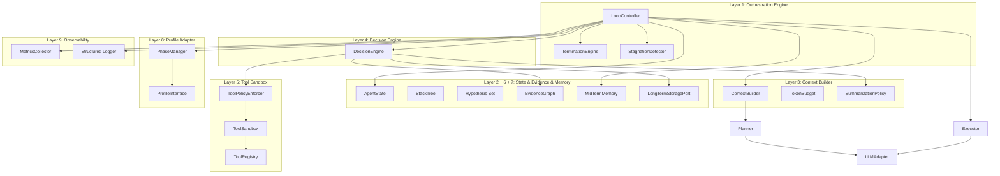
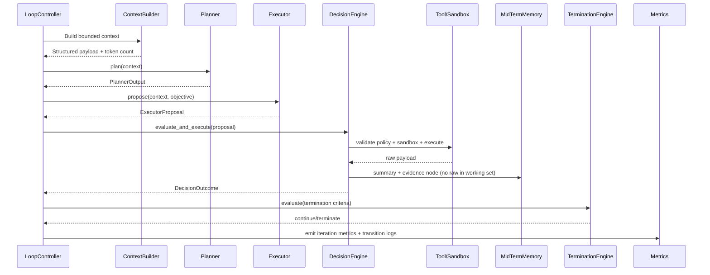

# agent-core Architecture

`agent-core` is a bounded orchestration engine for autonomous LLM-driven reasoning. The architecture follows clean/hexagonal boundaries so each major subsystem is independently replaceable and testable.

## Design Goals
- Deterministic loop control
- Strict bounded memory and context
- Planner/executor isolation
- Tool gating through policy and sandbox
- Evidence-centric state evolution
- Profile-driven domain specialization without core mutation

## Layered Architecture

## Deterministic Control Loop

## State Boundaries

```mermaid
flowchart LR
    subgraph WM["Short-Term Working Memory (LLM-visible)"]
      G["Goal"]
      P["Phase"]
      A["Active Node"]
      H["Top Hypotheses"]
      E["Top Evidence Summaries"]
      T["Latest Tool Summary"]
    end

    subgraph MT["Mid-Term Structured Memory"]
      EG2["EvidenceGraph"]
      HY2["Hypotheses"]
      ST2["StackTree"]
      DH["Decision History"]
      IS["Iteration Summaries"]
    end

    subgraph LT["Long-Term Storage"]
      RAW["Raw Tool Outputs"]
      SNAP["Snapshots"]
      LOGS["Raw Reasoning Logs"]
    end

    MT -->|Selective ranking| WM
    LT -->|Pointers only| MT
```

## Core Safety Invariants
- Context budget is hard-capped by `TokenBudget` and trimmed by priority.
- Evidence growth is bounded by `EvidenceGraph.max_nodes` with deterministic pruning.
- Stack depth is bounded by `StackTree.max_depth`; collapse logic handles drift/stagnation.
- Executor proposals cannot mutate phase/hypotheses/stack directly.
- Every tool call is validated (`ToolRegistry` + schema), authorized (`ToolPolicy`), and sandboxed.
- Raw tool output is persisted to long-term storage and replaced with structured summaries.
- Every iteration emits metrics and explicit state transition logs.

## Extension Points
- Profiles: implement `ProfileInterface` and plug into `PhaseManager`.
- LLM providers: implement `LLMAdapter`, register in `ModelRegistry`.
- Storage backends: implement storage ports (`StorageBackend`, `LongTermStoragePort`).
- Multi-agent: share `EvidenceGraph` and memory contracts while adding orchestrator roles.
